# 期末创新项目—盲人辅助系列产品

## 一、项目背景

### 1.1 市场情况

根据新思界产业研究中心发布的《2021-2025年全球盲人智能助视器行业深度市场调研及重点区域研究报告》显示， 在全球中，中国是盲人数量最多的国家，在2020年盲人数量约为830万人，站全球失明人口的21%左右， 且每年新增盲人数量已经达到40万以上。 我国盲人数量庞大，但国内无障碍建设规范化不足，盲人几乎无法独立出行。 随着我国人民生活水平的提升，盲人对于生活质量优化需求强烈，进而带动智能助视器市场需求攀升， 在2020年我国智能助视器市场规模约为16.2亿元，预计随着智能助视器技术的逐渐成熟， 到2025年市场规模将达到76.7亿元。

当前国内针对于智能助视器研发的企业较少，且大多产品智能化低，对于盲人的辅助作用较小，
总体来看我国盲人用品市场尚未得到重视。但未来在人口老龄化背景下，盲人数量增长，以及生活和医疗水平提升，居民对与智能助视器需求持续攀升，智能助视器市场发展空间巨大。


### 1.2 产品研究现状

盲人智能助视器是利用计算机视觉技术，为盲人实现视觉功能代偿的智能辅助设备。根据技术原理不同，盲人智能助视器可分为植入型BMI类、非植入型BMI类、视听转化类三种产品。

试听转化类智能助视器是利用计算机视觉、智能语音技术，将视觉信息转化为听觉信息，帮助视力障碍者识别颜色、文字、钞票和障碍物。试听转化类智能助视器行业近几年发展快速，生产企业主要有中国的视氪和肇观电子、瑞士Eyra、以色列OrCam。

- 植入型BMI产品，是一种视网膜假体植入系统，以植入的系统替代受损的光感受器和退化的外层视网膜细胞的功能，主要适用于视网膜神经完好的患者，如黄斑变性导致失明和视网膜色素变性等因素造成失明的患者。
  植入型BMI产品属于第三类医疗器械，生产技术较高，仅有美国的第二视觉医疗器材公司研发了产品。

- 非植入性BMI类产品的代表作是BrainPort。BrainPort是由美国科学家研究的一种，可以让盲人利用舌头表面的神经向大脑发送光信号，使得大脑将其他感知器官获得的有效信息补偿给受损的感知系统。BrainPort属于第二类医疗器械，与其他盲人智能助视器相比，其具有无创伤、非植入的优点，在安全性、适用性较高，是导盲犬、盲杖等产品的替代品，更为适合在盲人群体中得到应用。


## 二、 CracKiller

### 2.1 产品介绍

盲人难以分辨复杂的地形环境（坑洼）以及人为抛撒物所导致的路障，因此其在独自行走时主要依靠导盲装置。最简单常用的装置是普通的手杖,用它在地面上敲击，可帮助盲人发现0.5米以内的障碍物。它的主要缺点是发现障碍范围小、发现障碍距离短。有时候盲人发现前方障碍时，距离过近，反应时间所剩无几，很难规避风险。

针对以上问题我们提出了一种视听转化类智能助视器产品的构思，即利用计算机视觉、智能语音技术，将视觉信息转化为听觉信息，帮助盲人分辨道路情况。
它不仅侦查范围大，侦测距离长，并且从发现障碍到发出警告的反应时间远短于人类的反应时间，性能优秀，安全性高。

**功能简要介绍**：我们的视听转化产品小巧易携，仅需佩戴到胸前，当遇到抛撒物或坑洼等物体时，它就会发出警告声提醒盲人避开障碍。


### 2.2 设计思路

**项目流程图**

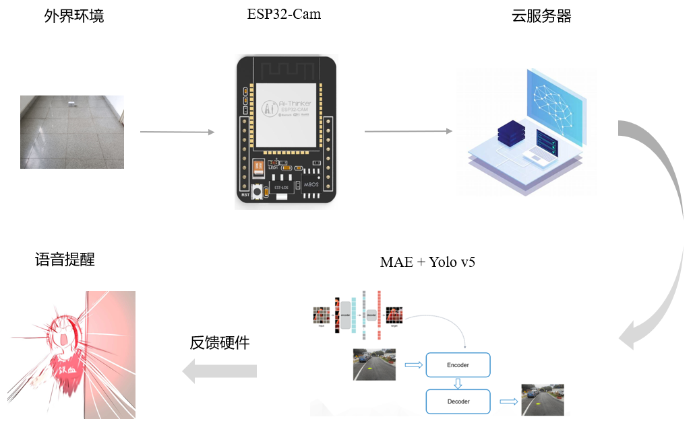


**项目目录结构**

```bash
----期末项目\
    |----CameraWebServer\        硬件部分 主要用于控制ESP320-Cam拍摄照片以及与服务器的通信
    |----README.md
    |----result\                 结果展示
    |----yolov5\                 YOLO v5目标检测
    |    |----detect.py          yolo推理
    |    |----image_interface\
    |    |    |----get_image.py  图片获取接口
    |    |    |----images\       存放拍摄的图片
    |    |----model_path\        模型权重
    |    |----requirements.txt   需求文件
    |    |----runs\              运行结果
    |    |    |----detect\
    |    |----webserver\         Web服务器通信部分
    |    |    |----data\
    |    |    |    |----data.txt
```

**TODO**

- [x] 基于MAE+YOLO v5实现目标检测

- [x] 实现ESP32-CAM自动采集数据

- [x] 实现芯片与服务器的高效数据传输

- [x] 当检测到目标物体时，语音提醒用户

- [ ] 支持更快、更多元的检测，更友好的提醒方式

- [ ] ...

  

#### 2.2.1 ESP32-Cam图像采集

ESP32-CAM 是最受欢迎且价格合理的已集成摄像头的开发板之一，它结合了 Espressif ESP32-S MCU 芯片和 ArduCam OV2640 摄像头。ESP32 芯片功能强大，甚至可以处理图像。它包括 I2C、SPI、UART 通信以及 PWM 和 DAC 输出。因此我们利用ESP32-Cam来进行图像数据的采集，并上传到服务器中进行处理。

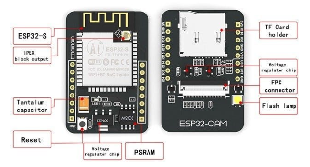


利用集成 USB-TTL 串行模块将代码上传到 ESP32-CAM

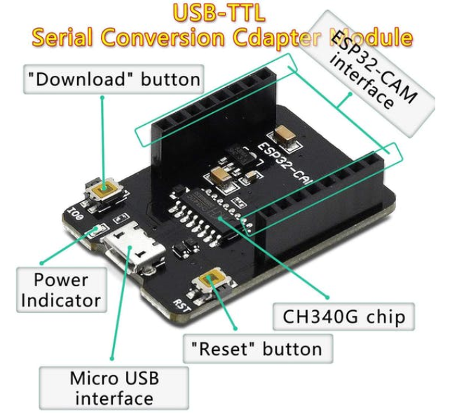


#### 2.2.1 图像数据上传

当服务器和ESP32-CAM芯片处于同一网段时，就可以通过分配的IP访问其数据端口，从而获取图像信息，由于默认情况下IP是随机分配的，所以我们可以通过分配local IP的方式指定IP地址，代码如下图所示：

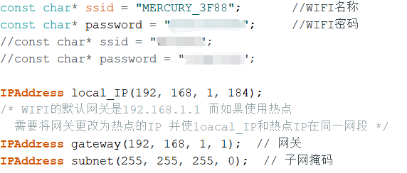


当通过IP访问80端口时，进入的是一个操作界面，在这个界面中显示有当前摄像头采集的视频流，那么如何一段时间采集一张图像进行预测呢？我们使用selenium Web自动化工具来进行实现，部分实现代码如下图所示：

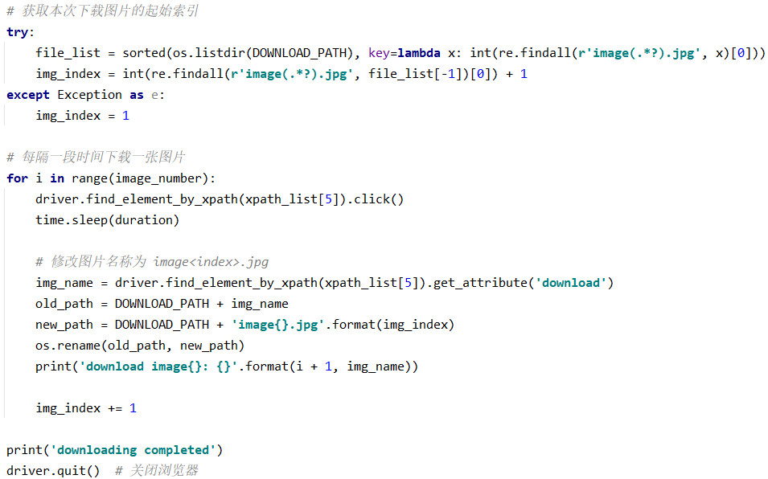


#### 2.2.3 MAE + YOLO v5

我们运用自监督学习（MAE、MaskFeat）对图像数据进行特征提取，然后迁移到下游的目标检测任务中，采用的目标检测算法是YOLO v5。首先我们分别介绍MAE和YOLO v5算法。

**MAE算法流程**

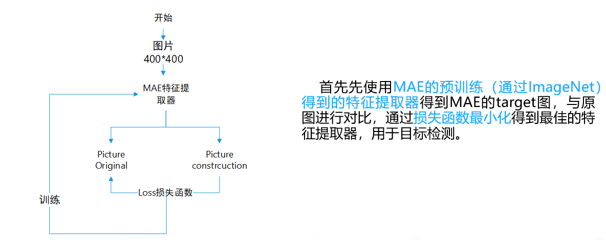


**YOLO v5目标检测**

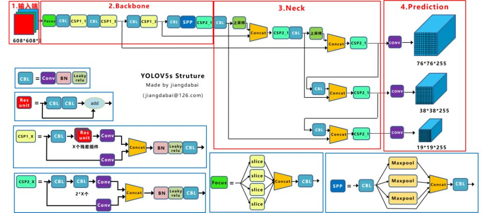


YOLO v5主要由输入端、Backone、Neck以及Prediction四部分组成。其中：

(1) Backbone：在不同图像细粒度上聚合并形成图像特征的卷积神经网络。

(2) Neck：一系列混合和组合图像特征的网络层，并将图像特征传递到预测层。

(3) Prediction：对图像特征进行预测，生成边界框和并预测类别。

- 对于Backone网络，我们主要采用CSP结构。
  CSPNet主要是将feature map拆成两个部分，一部分进行卷积操作，
  另一部分和上一部分卷积操作的结果进行concate。
  在目标检测问题中， 使用CSPNet作为Backbone带来的提升比较大，
  可以有效增强CNN的学习能力，同时也降低了计算量。
  yolo V5设计了两种CSP结构，CSP1_X结构应用于Backbone网络中，CSP2_X结构应用于Neck网络中。

- 对于Neck网络，在YOLO v4中开始使用FPN-PAN。其结构如下图所示，YOLO v5的Neck仍采用了FPN+PAN结构，但是在它的基础上做了一些改进操作，yoloV4的Neck结构中，采用的都是普通的卷积操作，而YOLO v5的Neck中，采用CSPNet设计的CSP2结构，从而加强了网络特征融合能力。

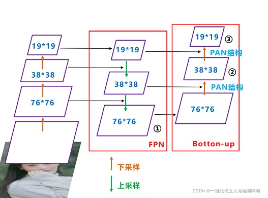


**迁移学习**

我们将训练好的MAE算法的Encoder迁移到目标检测任务中，从而提高目标检测任务的预测效果，因此模型的整体结构如下图所示：


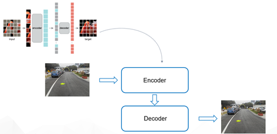


#### 2.2.4 语音提醒

首先我们需要通过HTTPClient来获取服务器反馈给芯片的预测结果，然后发出指定的语音信息，因此实际上就是服务器和芯片的通信，下面给出部分的arduino代码：

```arduino
/* 开始访问指定服务器地址，获取数据  */
Serial.print("Connected to ");
Serial.println(ssid);
HTTPClient http;
Serial.print("[HTTP] begin...\n");
http.begin("http://192.168.1.101/data/data.txt"); //访问服务器地址

Serial.print("[HTTP] GET...\n");
// start connection and send HTTP header
int httpCode = http.GET();

// httpCode will be negative on error
if(httpCode > 0) {
    // HTTP header has been send and Server response header has been handled
    Serial.printf("[HTTP] GET... code: %d\n", httpCode);

    // file found at server
    if(httpCode == HTTP_CODE_OK) {
        String payload = http.getString();
        Serial.println(payload);

        if(payload == "1"){
            flag=1;
        }
        else{
            flag=0;
        }
    }
} 
http.end();
```


#### 2.2.5 外观设计

我们的产品外包包装分为两部分，其展示图如下

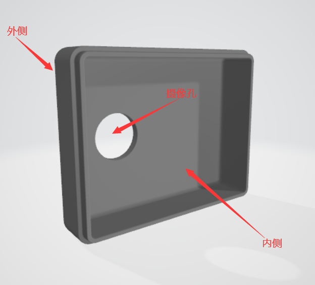

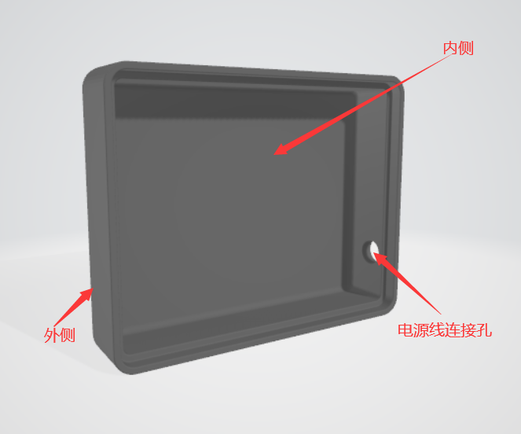


### 2.3 成品展示

这是我们所使用的ESP32-Cam开发板：

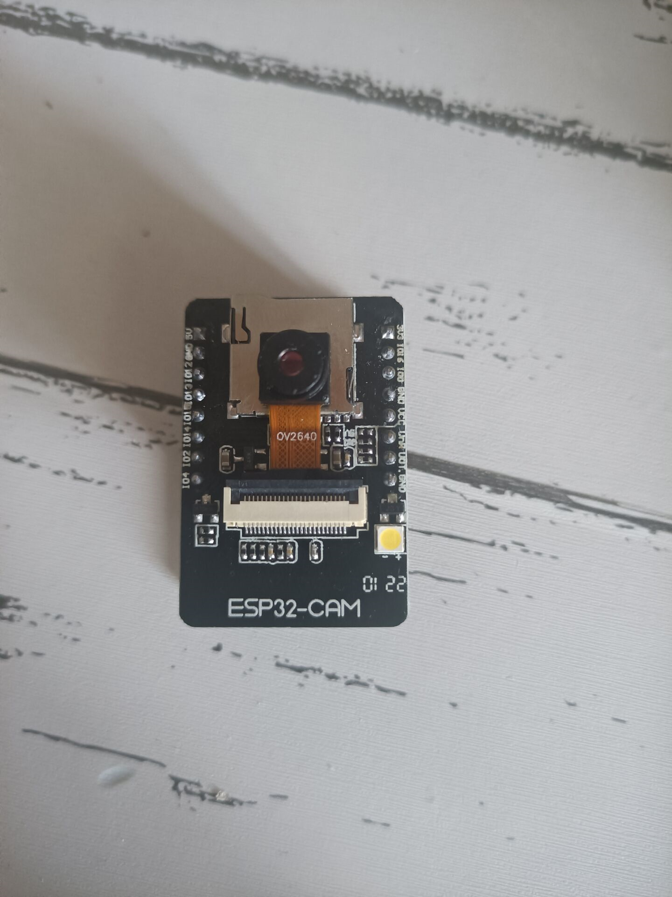


我们产品的整体样式如下图所示：

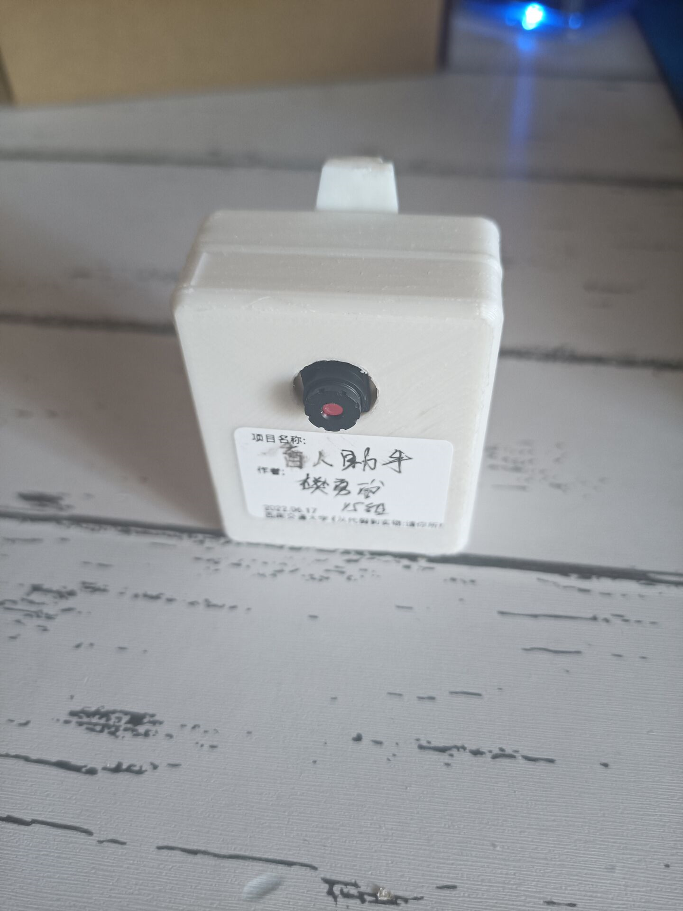


可见，产品外观简洁美观，小巧便利，重量也很轻，对于盲人携带非常友好。

实际使用中，也可见产品的性能十分优秀：

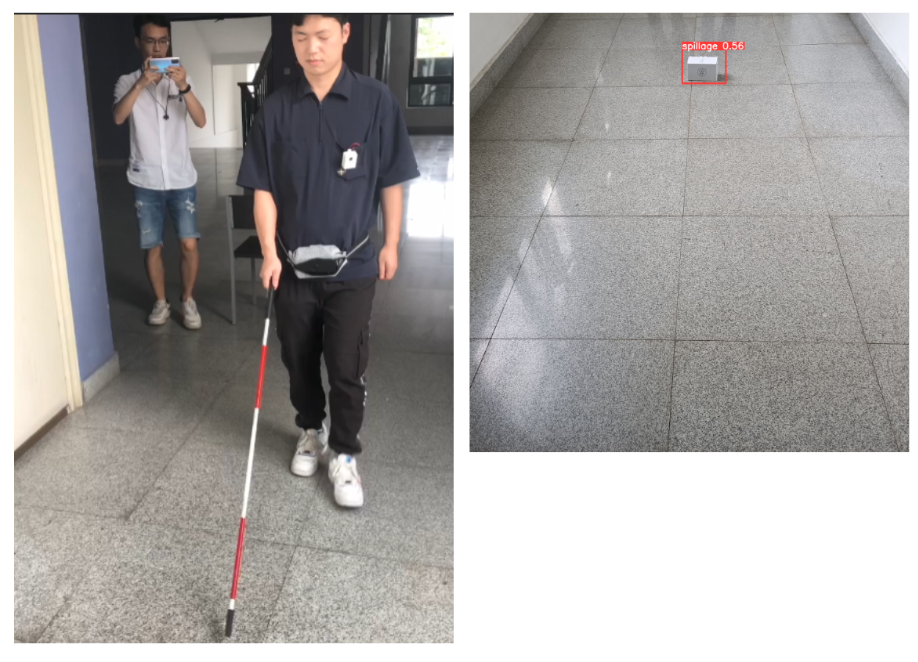我们把产品和常用的盲人手杖进行了对比实验，上图不难看出，在手杖还未能到达的距离里，我们的盲人助手产品就已经识别并做好了发出警报的准备，给足了盲人反应时间，十分安全可靠。


## 三、可嵌入障碍检测器

### 3.1 产品介绍

本产品为带继电器输出的超声波测距模组，可自行设置检测距离，设置距离内可控制继电器输出。

它可以应用于：

- 水平测距；

- 避障、自动控制；

- 物体接近、存在察觉

- 交通控制；

- 安防、工业控制；

- 人工智能、教研

  

### 3.2 使用说明

本产品可自定义继电器触发量程，如超声波模块检测量程5cm – 500cm，实际应用场景需要100cm触发继电器输出，可通过本产品按键进行自由设置
具体操作如下：

- 第一步，将探头对着平面（如墙面）摆放至100cm处
- 第二步，长按“距离设置键”2S以上，绿色指示灯会闪烁一次设置完成，100cm以内时，工作指示灯常亮且继电器闭合，超出100cm时工作指示灯熄灭且继电器断开；


### 3.3 成品展示

产品外观如图所示：

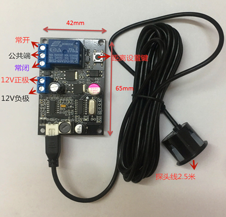


其应用于我们的产品中的效果：

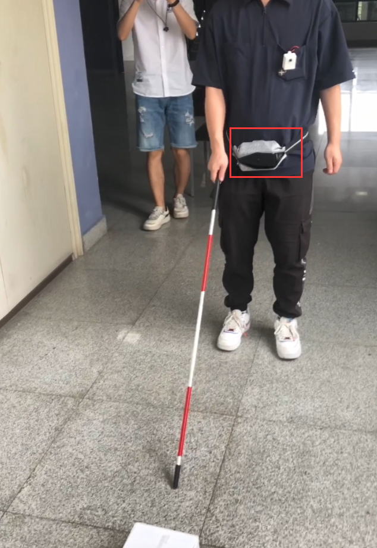